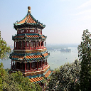
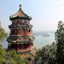
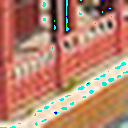
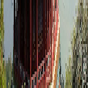
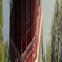
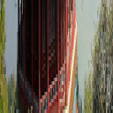

# resize_image

PillowとOpenCVとTensorFlowのリサイズ結果を比較してみた。

## 結論

- cv2とTensorFlowのAREAは拡大ではNEAREST？
- cv2のLANCZOS4は縮小ではNEAREST？
- TensorFlowのlanczosは(元々float32で返ってくるが)clipせずuint8にキャストするとオーバーフローする事があるので要注意
- 混在はPILかTF(でちゃんと処理したもの)が一番綺麗そう？

## 実験結果

### 元画像 (`sklearn.datasets.load_sample_image("china.jpg")`)

### 縮小 (元画像 → 縮小(128x128))

| cv2 LANCZOS4                       | cv2 AREA                           | PIL NEAREST                        | PIL LANCZOS                        | tf lanc                           | tf  area                          |
| ---------------------------------- | ---------------------------------- | ---------------------------------- | ---------------------------------- | --------------------------------- | --------------------------------- |
|  |  |  |  |  |  |

### 拡大 (元画像 → 切り取り(32x32) → 拡大(128x128))

| cv2 LANCZOS4                           | cv2 AREA                               | PIL NEAREST                            | PIL LANCZOS                            | tf lanc                               | tf  area                              |
| -------------------------------------- | -------------------------------------- | -------------------------------------- | -------------------------------------- | ------------------------------------- | ------------------------------------- |
|  |  |  |  |  |  |

### 混在 (元画像 → 切り取り(512x32) → リサイズ(128x128))

| cv2 LANCZOS4                   | cv2 AREA                       | PIL NEAREST                    | PIL LANCZOS                    | tf lanc                       | tf  area                      |
| ------------------------------ | ------------------------------ | ------------------------------ | ------------------------------ | ----------------------------- | ----------------------------- |
|  |  |  |  |  |  |
